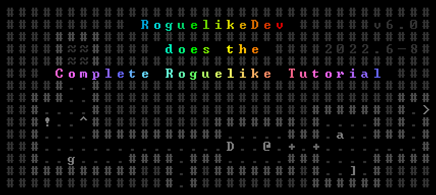

# WGLT Roguelike Tutorial



Implementation of [/r/roguelikedev](https://reddit.com/r/roguelikedev/)'s annual [Roguelike Tutorial](https://www.reddit.com/r/roguelikedev/comments/vhfsda/roguelikedev_does_the_complete_roguelike_tutorial/) using [TypeScript](https://www.typescriptlang.org/) and [WGLT](https://wglt.js.org/).

## Try it!

Play the current version here: <https://codyebberson.github.io/wglt-roguelike-tutorial/>

## Development

Clone:

```
git clone git@github.com:codyebberson/wglt-roguelike-tutorial.git
```

Start dev server:

```
npm run dev
```

## Notes

### Part 1 - Drawing the ‘@’ symbol and moving it around

See the initial commit here: <https://github.com/codyebberson/wglt-roguelike-tutorial/commit/d516d7c3183db2d2bbcdfb294bc2a76e321c635c>

### Part 2 - The generic Entity, the render functions, and the map

Tutorial: http://rogueliketutorials.com/tutorials/tcod/v2/part-2/

Pull Request: https://github.com/codyebberson/wglt-roguelike-tutorial/pull/14

### Part 3 - Generating a dungeon

Tutorial: http://rogueliketutorials.com/tutorials/tcod/v2/part-3/

Pull Request: https://github.com/codyebberson/wglt-roguelike-tutorial/pull/15


### Part 4 - Field of View

Tutorial: http://rogueliketutorials.com/tutorials/tcod/v2/part-4/

Pull Request: https://github.com/codyebberson/wglt-roguelike-tutorial/pull/16

https://user-images.githubusercontent.com/749094/178154479-516965c9-c4dc-497b-89bd-7c87117c7b5f.mp4

### Part 5 - Placing Enemies and kicking them (harmlessly)

Tutorial: http://rogueliketutorials.com/tutorials/tcod/v2/part-5/

Pull Request: https://github.com/codyebberson/wglt-roguelike-tutorial/pull/17


### Part 6 - Doing (and taking) some damage

Tutorial: http://rogueliketutorials.com/tutorials/tcod/v2/part-6/

Pull Request: https://github.com/codyebberson/wglt-roguelike-tutorial/pull/18

https://user-images.githubusercontent.com/749094/179381736-a8e2bff7-e1c3-4ff0-9c4c-5de609f8bffc.mp4

### Part 7 - Creating the Interface

Tutorial: http://rogueliketutorials.com/tutorials/tcod/v2/part-7/

Pull Request: https://github.com/codyebberson/wglt-roguelike-tutorial/pull/19

https://user-images.githubusercontent.com/749094/179420966-659fb252-da3b-4102-a213-3e9a4d0e1ed7.mp4

### Part 8 - Items and Inventory

Tutorial: http://rogueliketutorials.com/tutorials/tcod/v2/part-8/

Pull Request: https://github.com/codyebberson/wglt-roguelike-tutorial/pull/20


### Part 9 - Ranged Scrolls and Targeting

Tutorial: http://rogueliketutorials.com/tutorials/tcod/v2/part-9/

Pull Request: https://github.com/codyebberson/wglt-roguelike-tutorial/pull/21


### Part 10 - Saving and loading

Tutorial: http://rogueliketutorials.com/tutorials/tcod/v2/part-10/

Pull Request: https://github.com/codyebberson/wglt-roguelike-tutorial/pull/22


### Part 11 - Delving into the Dungeon

Tutorial: http://rogueliketutorials.com/tutorials/tcod/v2/part-11/

Pull Request: https://github.com/codyebberson/wglt-roguelike-tutorial/pull/23


